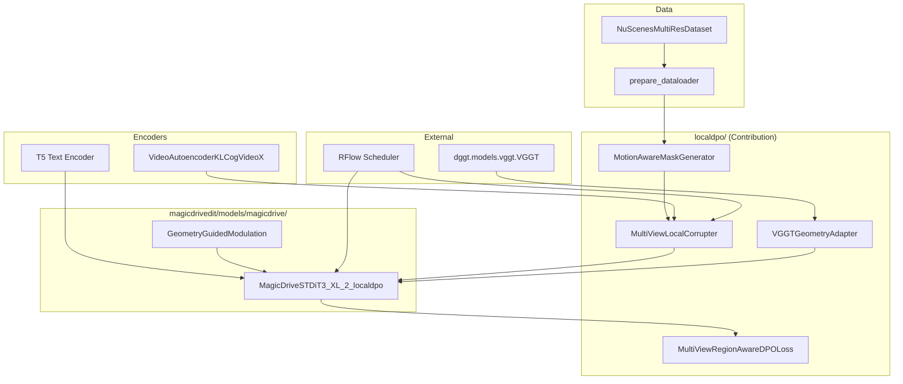

# Architecture Guide

This document describes the **active code path** used by `train.sh` and `test.sh`, and how the RiskMV-DPO modules connect to the MagicDrive backbone.

---

## 1. Entry Points

### Training (`train.sh` → `scripts/train_localdpo.py`)

```
train.sh
 └── torchrun scripts/train_localdpo.py
      └── configs/magicdrive/train/stage6_...localdpo.py
```

### Inference (`test.sh` → `scripts/inference.py`)

```
test.sh
 └── torchrun scripts/inference.py
      └── configs/magicdrive/inference/localdpo_fullx424x800_...py
```

All configs are resolved relative to the repository root. Override any field via `--cfg-options key=value`.

---

## 2. Module Graph



---

## 3. Core Modules

### 3.1 `localdpo/motion_aware_mask.py`

Generates spatio-temporal masks over 6 camera views:

1. Frame-difference motion estimation per view
2. Threshold + rectangular mask sampling on high-motion pixels
3. Fallback random mask when scene is static (prevents empty DPO pairs)

**Output:** binary mask `M ∈ {0,1}^{B×6×T×H×W}`

### 3.2 `localdpo/corrupter.py` — `MultiViewLocalCorrupter`

Implements the LocalDPO corrupt-and-restore pipeline:

1. Add RFlow noise inside mask region → `x_noisy`
2. Denoise with **frozen** reference model → `x_restored`
3. Compose: `x̃ = M ⊙ x_restored + (1−M) ⊙ x_real`

Uses the same noise schedule as the main RFlow training objective.

### 3.3 `localdpo/localdpo_loss.py` — `MultiViewRegionAwareDPOLoss`

Combined objective:

```
L_total = λ_ra · L_DPO + λ_sft · L_SFT + λ_align · L_geo
```

- **L_DPO**: region-weighted preference loss (preferred = real, rejected = corrupted-restored)
- **L_SFT**: standard flow-matching loss on unmasked regions
- **L_geo**: alignment between predicted and VGGT geometry latents (cosine / KL / contrastive)

Dynamic timestep weighting follows LocalDPO (higher weight at mid-noise levels).

### 3.4 `localdpo/vggt_scorer.py` — `VGGTGeometryAdapter`

Gen3R-style adapter:

```
RGB frames → VGGT (frozen) → patch tokens → Linear proj → Transformer → geo_latents [B·NC, 16, 1152]
```

Supports classifier-free guidance via learnable null geometry tokens.

### 3.5 `magicdrivedit/models/magicdrive/magicdrive_stdit3_localdpo.py`

Extends `MagicDriveSTDiT3` with:

| Submodule | Role |
|-----------|------|
| `GeometryGuidedModulation (GAM)` | Modulates attention scale/shift from geometry latents; zero-init gate |
| `VGGTGeometryAdapter` hook | Injects geometry at selected transformer layers |
| Registry key | `MagicDriveSTDiT3-XL/2-localdpo` |

**First-frame protection:** geometry modulation is disabled on the first temporal frame to preserve conditioning quality.

---

## 4. Training Step (Simplified)

```python
# scripts/train_localdpo.py — conceptual flow
mask = motion_mask_generator(video)
x_corrupted = corrupter(video, mask, ref_model=ema_model)
pred = model(latent, geometry=geo_adapter(video), ...)
loss = dpo_loss(
    preferred=target,
    rejected=x_corrupted,
    ref_output=ema_pred,
    mask=mask,
    geo_latents=geo_adapter(video),
)
loss.backward()  # only trainable params: GAM, geo_adapter, DPO heads
```

Trainable parameters are collected by `collect_trainable_params()` — backbone weights remain frozen unless explicitly unfrozen in config.

---

## 5. Registry & Config Wiring

Configs use MMEngine-style dicts parsed by `magicdrivedit.utils.config_utils.parse_configs`.

| Config key | Built via | Implementation |
|------------|-----------|----------------|
| `model.type` | `MODELS.build` | `magicdrive_stdit3_localdpo.py` |
| `vae.type` | `MODELS.build` | `vae_cogvideox.py` |
| `text_encoder.type` | `MODELS.build` | `t5.py` |
| `scheduler.type` | `SCHEDULERS.build` | `rectified_flow.py` |
| `dataset.type` | `DATASETS.build` | `nuscenes_variable.py` |

---

## 6. What Was Removed / Archived

The following are **not** on the main train/test path and were moved or deleted during cleanup:

| Category | Action |
|----------|--------|
| `*0.py`, `*1.py` backup files | Deleted (unreferenced duplicates) |
| `inference_magicdrive.py`, `worldcache` variant | Deleted (merged into `scripts/inference.py`) |
| `train_magicdrive*.py` (baseline/dggt/latent) | Moved to `experiments/baseline/` |
| `train_magicsora*.py` | Moved to `experiments/magicsora/` |
| `magicsora_stdit3` model import | Removed from `__init__.py` (lazy loading) |
| `third_party/*` (TAPIP3D, megasam, etc.) | Not imported by main path; optional |

---

## 7. Extending the Framework

**Add a new loss term:** extend `MultiViewRegionAwareDPOLoss.forward()` and expose weight via stage6 config.

**Change mask strategy:** subclass or modify `MotionAwareMaskGenerator`; wire in `build_motion_mask_generator(cfg)`.

**Unfreeze backbone layers:** set `freeze_old_params=False` in model config (not recommended for efficient fine-tuning).

**New resolution bucket:** update `bucket_config` and `data_cfg_names` in the stage6 training config.

---

## 8. File Dependency Quick Reference

```
scripts/train_localdpo.py
├── localdpo/corrupter.py
├── localdpo/localdpo_loss.py
├── localdpo/motion_aware_mask.py
├── magicdrivedit/datasets/
├── magicdrivedit/models/magicdrive/magicdrive_stdit3_localdpo.py
│   ├── dggt/models/vggt.py
│   └── localdpo/vggt_scorer.py
└── magicdrivedit/schedulers/rf/rectified_flow.py

scripts/inference.py
├── magicdrivedit/models/magicdrive/magicdrive_stdit3_localdpo.py  (via config)
├── magicdrivedit/utils/inference_utils.py
└── magicdrivedit/datasets/nuscenes_t_val_dataset.py
```
